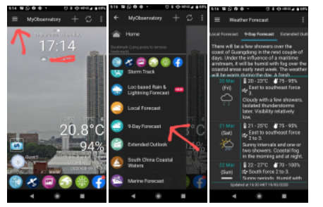
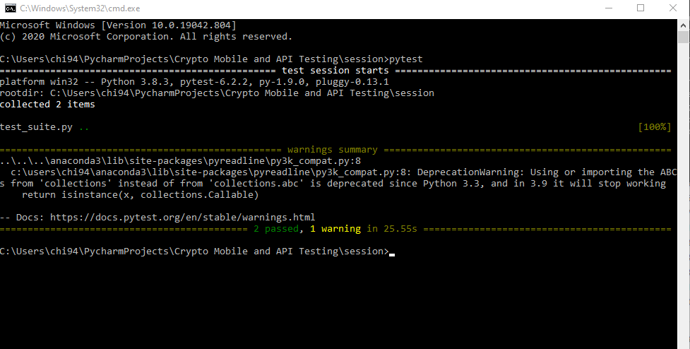

# Mobile and API Testing Challenge

This repository contains python scripts for two automated tests for tasks below. Pytest is used as the testing framework and Appium is used for the mobile automation. The mobile testing will be done through connecting to a real Samsung S20 device and executed using a Windows 10 machine.

### Task 1
Create an automated test case to check tomorrow forecast from 9-day forecast screen in the Hong Kong Observatory App.



### Task 2
Use the 9-day forecast API from the Hong Kong Observatory to:
1. Capture the related API endpoint
2. Send a request using this API endpoint
3. Test the request response status is whether successful or not
4. Extract the relative humidity (e.g., 60 - 85%) for the day after tomorrow from the API response (e.g. if today is Monday, then extract the relative humidity for Wednesday)


## Pre-requisites 

Ensure you have the following:
* [Appium installed](https://appium.io/docs/en/about-appium/getting-started/?lang=en) - the webserver used to execute commands on a mobile device
* Windows 10 operating system
* Samsung S20 (or emulate S20 device from Android Studios)

## Setting up the test environment
1. Download the MyObservatory app APK - [Link here](https://m.apkpure.com/myobservatory-%E6%88%91%E7%9A%84%E5%A4%A9%E6%96%87%E5%8F%B0/hko.MyObservatory_v1_0)
2. Place the APK in the base directory
3. Open up the Command Line in the base directory
4. Run the code below to install package dependencies 
```python
pip install -r requirements.txt
```

## Setting up the Appium Server
1. Open up the Appium application
2. Start server with Port = 4723
3. Connect the S20 device to your PC with USB debugging ON in the developer options
4. Open the Windows Command Line and execute $adb devices to find your device name
5. Open the config.py and edit the "deviceName": within the desired_cap dictionary to match the device name from step 4
```python
desired_cap = {
    "platformName": "Android",
    "deviceName": "DEVICE_NAME_HERE",
    "platformVersion": "10.0",
    "app": app_path,
    "newCommandTimeout": 0,
    'appPackage': '',
    'appWaitActivity': ''
}
```

## Running the tests
### Description of the automated tests and their steps
#### Test One
This corresponds to Task One where it checks the mobile navigation to 9-Day Forecast page using an Samsung S20 device. The steps for this test are:
1. Launch the Hong Kong Observatory App
2. Click on the pop-ups to remove them
3. Select the navigation menu and select the 9-Day Forecast
4. Assert the content for tomorrow's forecast is above 0 in length

#### Test Two
This corresponds to Task Two where it checks the Hong Kong Observatory API in particular the 9-Day Forecast and we are able to extract the relative humidity. The steps for this test are:
1. Create a GET request to the Hong Kong Observatory using the parameters 'dataType': 'fnd' and 'lang': 'en'
2. Assert that the response is 200 (OK)
3. Extract the minimum and maximum relative humidity 
4. Assert that minimum relative humidity is zero or above
5. Assert that maximum relative humidity is the minimum relative humidity or above 

### Executing Pytest

Executing Pytest will make it read the test_suite.py which contains the automated test cases and run the testing suite. The steps to execute Pytest are: 
1. Open the Windows Command Line
2. Execute $pytest
5. Pytest will return the results in the command window

## Example of results



