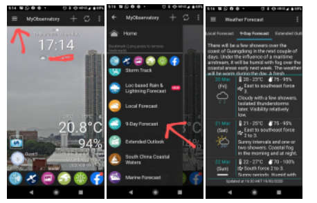
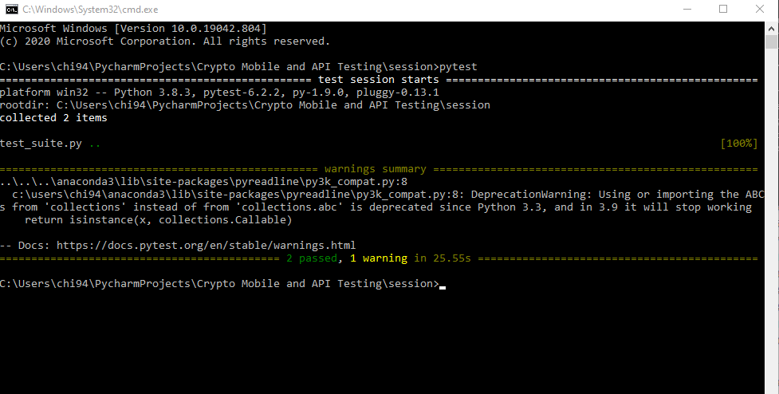

# Mobile and API Testing


**Table of Contents**
- [Introduction](#introduction)
- [Motivation](#motivation)
- [Technology Used](#technologyUsed)
- [Build Status](#buildStatus)
- [Features](#features)
- [Installation](#installation)
- [Execution](#execution)

## Introduction <a name="introduction"></a>
Project contains two tests for the Hong Kong Obseratory mobile application. These tests are:
* Check the weather information on the front-end is correct
* Check the API returned data is correct 

## Motivation <a name="motivation"></a>
This is a personal learning project aimed to further improve my automated testing knowledge.

## Technology Used <a name="technologyUsed"></a>
<table>
  <tbody>
    <tr>
      <td>Language</td>
      <td>Python</td>
    </tr>
    <tr>
      <td>Frameworks</td>
      <td>Pytest, Appium</td>
    </tr>
    <tr>
      <td>Others</td>
      <td>Physical Samsung Galaxy S20</td>
    </tr>
  </tbody>
</table>

## Build Status <a name="buildStatus"></a>
Project is completed.

## Features <a name="features"></a>
This project contains 2 automated tests. First is for the front-end and second is for the API data.

### Test 1
This will check if the information on the 9-Day Forecast activity window is as expected. The steps are:
1. Launch the Hong Kong Observatory App
2. Click on the pop-ups to remove them
3. Select the navigation menu and select the 9-Day Forecast
4. Assert the content for tomorrow's forecast is above 0 in length



### Test 2
This will check if the API is 200 OK and as expected. The steps are:
1. Capture the related API endpoint
2. Send a request using this API endpoint
3. Test the request response status is whether successful or not
4. Extract the relative humidity (e.g., 60 - 85%) for the day after tomorrow from the API response (e.g. if today is Monday, then extract the relative humidity for Wednesday)


# Installation <a name="installation"></a>

**Pre-requisites**
* [Appium installed](https://appium.io/docs/en/about-appium/getting-started/?lang=en) - the webserver used to execute commands on a mobile device
* Samsung S20 (or emulate S20 device from Android Studios)

## Setting up environment
1. Download the MyObservatory app APK - [Link here](https://m.apkpure.com/myobservatory-%E6%88%91%E7%9A%84%E5%A4%A9%E6%96%87%E5%8F%B0/hko.MyObservatory_v1_0)
2. Place the APK in the base directory
3. Open up the Command Line in the base directory
4. Run the code below to install package dependencies 
```python
pip install -r requirements.txt
```

## Setting up the Appium Server
1. Open up the Appium application
2. Start server with Port = 4723
3. Connect the S20 device to your PC with USB debugging ON in the developer options
4. Open the Windows Command Line and execute $adb devices to find your device name
5. Open the config.py and edit the "deviceName": within the desired_cap dictionary to match the device name from step 4
```python
desired_cap = {
    "platformName": "Android",
    "deviceName": "DEVICE_NAME_HERE",
    "platformVersion": "10.0",
    "app": app_path,
    "newCommandTimeout": 0,
    'appPackage': '',
    'appWaitActivity': ''
}
```
# Execution <a name="execution"></a>
Executing Pytest will make it read the test_suite.py which contains the automated test cases and run the testing suite. The steps to execute Pytest are: 
1. Open the Windows Command Line
2. Execute $pytest
5. Pytest will return the results in the command window

## Example of results

